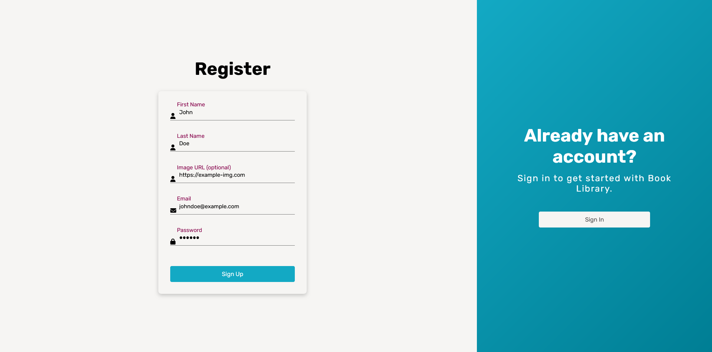

# Odin Book Library

---

## Live Demo

[**Try the Odin-Book-Library App Here**](https://book-library-60b1e.web.app/index.html)

---

## Screenshots

### Desktop


### Edit Book


### Add Book


### Search


### Mobile


### Sign In


### Sign Up



---

## Features

1. **Authentication with Firebase**

    - Users can sign up, log in, and log out securely using Firebase Authentication.
    - Supports email/password authentication.

2. **Manage Books**

    - Add books with details such as title, author, pages, and reading status.
    - Edit or delete books from the library.
    - Mark books as Read or Unread.

3. **Search**

    - Search books dynamically by title or author.

4. **Local Storage and Database**

    - User data is stored persistently in Firestore for real-time syncing across devices.
    - Keeps book preferences and statuses even after page refreshes.

5. **Responsive Design**

    - Fully responsive layout adapts to different screen sizes, from mobile to desktop.

---

## Technologies Used

-   **HTML5**:  
    Provides semantic structure and accessibility for the web app.

-   **CSS3**:

    -   Uses CSS Grid and Flexbox for responsive layout.
    -   Custom styling for UI elements, including buttons and modals.

-   **JavaScript (Vanilla JS)**:

    -   Implements dynamic functionality, including:
        -   Form Validation: Ensures book input fields are correctly filled
        -   Manipulate DOM.

-   **Firebase**:
    -   Firestore Database: Stores user books and syncs data in real time.
    -   Firebase Authentication: Manages user login and signup securely.
    -   Firebase Hosting: Hosts the app with a free Firebase subdomain.

---

## Project Structure

```
.
├── index.html      # Main HTML file
├── auth.html       # Authentication HTML file
├── style.css       # CSS styles
├── script.js       # JavaScript for interactivity
├── card.js         # JavaScript for book card
├── bookModal.js    # JavaScript for edit book
├── firebase.js     # JavaScript for firebase operations
├── mockBooks.js    # JavaScript for mock books
├── assets/         # Folder for images
└── README.md       # Project documentation
```

---

## Installation and Usage

1. Clone the repository:

    ```bash
    git clone <https://github.com/Szidelo/odin-book-library.git>
    ```

2. Navigate to the project directory:

    ```bash
    cd odin-book-library
    ```

3. Install Firebase CLI (if not installed):

    ```bash
    npm install -g firebase-tools
    ```

4. Deploy the app (if making modifications and redeploying):

    ```bash
    firebase deploy
    ```

5. Alternatively, open index.html in a browser for local testing.

---

## Acknowledgments

This project is part of the [Odin Project's JavaScript Course](https://www.theodinproject.com/lessons/node-path-javascript-library).

---
